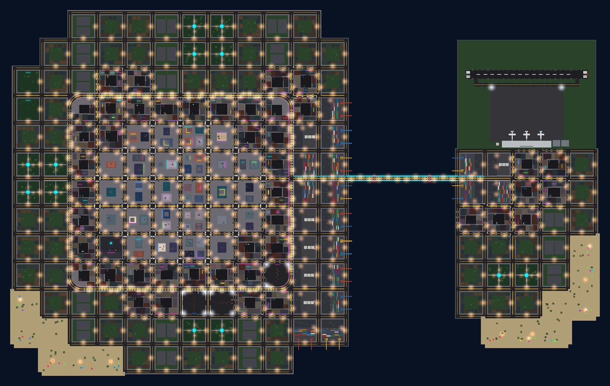
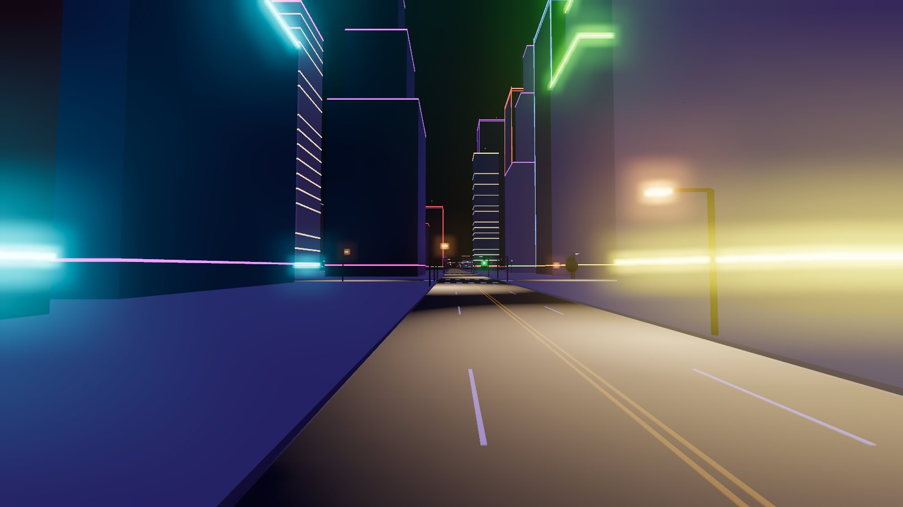
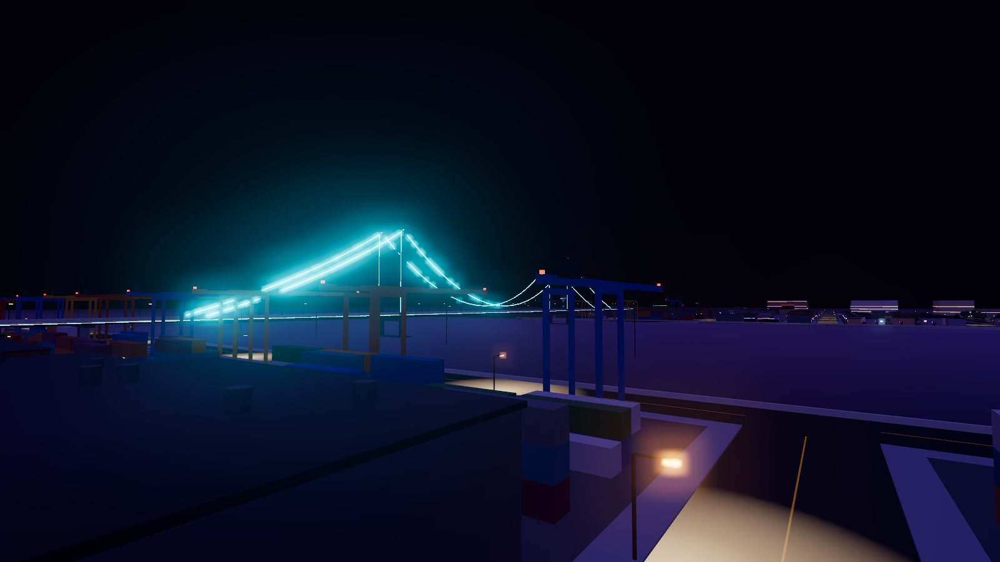
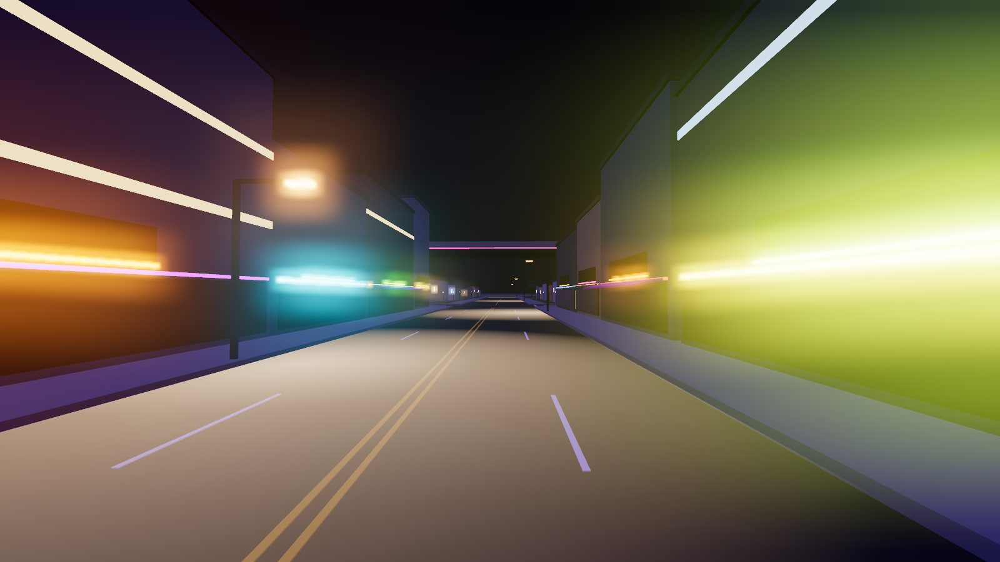
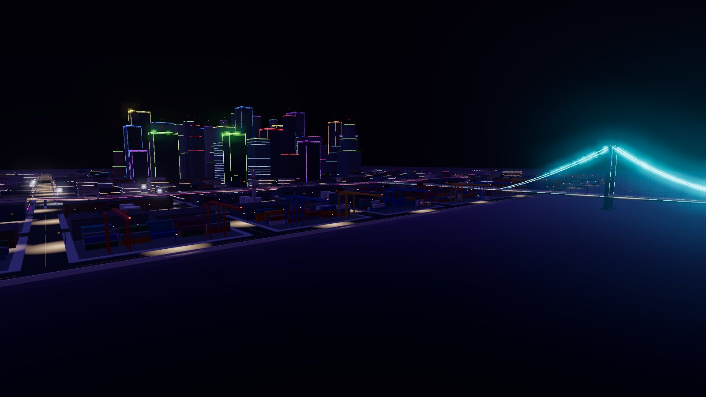

# Neon Bay – a night street-racing city for Roblox Studio

An original city map in the spirit of late-2000s underground racing games like *Need for
Speed: Underground 2*: wet-looking streets at night, sodium street lights, neon everywhere,
an elevated freeway ring and a glowing suspension bridge. Everything is built from Roblox
parts and built-in materials, so there is nothing to upload or wait for moderation on.



| | |
| --- | --- |
|  |  |
|  |  |

<sub>These previews come from a quick three.js approximation (`tools/preview`), not from
Roblox; in Studio the lighting and glow look somewhat different.</sub>

## Play it in 1 minute

1. Download [`dist/NeonBay.rbxl`](dist/NeonBay.rbxl) (on GitHub: open the file, then **Download raw file**).
2. In **Roblox Studio**: **File → Open from File...** and pick `NeonBay.rbxl`.
3. Press **Play** (F5). You spawn at the garage in the south-west of downtown.

The place has **no car** yet. The simplest way to get one is Roblox's own **Racing**
template: create a new place from it on Studio's start page, copy one of its cars, and paste
it next to the spawn here. Be careful with free cars from the Toolbox: some contain harmful
scripts. When you're ready, **File → Publish to Roblox**.

## What's in the map

* **Island city**: a 24 × 16 grid of 320-stud blocks (about 7,700 × 5,100 studs including
  the bay) with 4-lane streets, lane markings, crosswalks, curbs and about 600 street lamps.
* **Downtown**: glass and concrete towers up to about 570 studs, with neon crowns and edges,
  lit floors and blinking rooftop beacons.
* **Commercial strips**: shops with lit storefronts, neon signs, awnings, vertical hotel/bar
  signs and rooftop billboards.
* **Residential**: gabled houses with porch lights and gardens, and apartment blocks.
* **Harbor**: warehouses with loading docks, stacked containers, gantry cranes over the
  water and smokestacks.
* **Freeway**: an elevated ring road (about 9,000 studs) with smooth curves, 4 ramps down to
  the streets and overhead signs. It connects to the **Bay Bridge**, a suspension bridge with
  glowing cables, which leads to the east island.
* **East island**: an **airport** with a 1,400-stud runway (a ready-made drag strip),
  terminal, tower, hangars and parked airliners, plus industry, shops, homes and beaches.
* **Meet spots**: open lots with floodlights, cone slaloms and parked cars (drift/drag).
* **Garage hub**: four neon bays (Performance, Paint Shop, Body Kits, Car Lot) and the spawn.
* **Night look**: Future lighting, purple haze, bloom, a starry sky. A client script blinks
  aviation lights and cycles the downtown traffic lights.

It has about 21,000 parts, 700 lights and 760 neon signs. StreamingEnabled is on, and the
towers and bridge keep a low-detail skyline version when they are streamed out.

## Changing the map

The generator ships inside the place as `ServerStorage.NeonBay`, so you can rebuild the city
in Studio:

1. Open `ServerStorage → NeonBay → Config` and edit it.
2. Open **View → Command Bar**, paste this line and press Enter:

   ```lua
   require(game.ServerStorage.NeonBay:Clone()).build()
   ```

   Pass options to change more:
   `require(game.ServerStorage.NeonBay:Clone()).build({ seed = 7 })` gives different
   buildings on the same streets. `:Clone()` makes Studio pick up your edits.

The street layout is **ASCII art** in `Config.Map`. Each character is one block, and streets
run around every block:

```
~  water        D  downtown towers    C  shops / neon strip    R  houses & apartments
I  harbor       P  park               A  airport               B  beach
X  open lot     G  garage + spawn     .  open field
```

`Config.Freeway` lists the elevated roads by grid intersection (`{ column, row }`, counted
from the top-left corner of the map), plus the ramps and overhead signs. Other knobs:
`RoadWidth`, `FreewayHeight`, `LampDensity` (0.5 is lighter for phones) and the colours in
`Palette`.

For real waves and swimmable water in place of the flat water parts, run this in the command
bar (Studio only):

```lua
require(game.ServerStorage.NeonBay:Clone()).useTerrainWater()
```

## Your Assetto Corsa map (600 MB)

You can't upload a track that big straight into Roblox or into a chat. Roblox takes meshes of
at most 20,000 triangles each, and GitHub's browser upload stops at 25 MB per file. Most of
those 600 MB are textures anyway. [`tools/assetto/ac2roblox.py`](tools/assetto/ac2roblox.py)
handles both problems:

```bat
python tools\assetto\ac2roblox.py inspect  "...\assettocorsa\content\tracks\YOUR_TRACK"
python tools\assetto\ac2roblox.py pack     "...\tracks\YOUR_TRACK" -o ac_upload   (small package to share, no textures)
python tools\assetto\ac2roblox.py convert  "...\tracks\YOUR_TRACK" -o ac_output   (Roblox-ready meshes + helper model)
```

The step-by-step guide covers sharing the package on a branch of this repository, importing
into Studio, building a smooth road from the AI racing line, and what you're allowed to
convert: **[docs/assetto-corsa.md](docs/assetto-corsa.md)**.

## Working on the code

| Path | What it is |
| --- | --- |
| `src/NeonBay/` | Map generator (Luau): `Config`, `Grid`, `Ground`, `Streets`, `Freeway`, `Districts/*`, `Props`, `Atmosphere` |
| `src/Client/` | Client ambience script (traffic lights, beacons) |
| `scripts/build.luau` | Builds `dist/NeonBay.rbxl` offline with [Lune](https://lune-org.github.io/docs) |
| `scripts/test.luau` | Geometry checks: ramps join up, no building in the freeway, no overlapping road slabs, ... |
| `tools/assetto/` | Assetto Corsa converter (Python, standard library only) and its tests |
| `tools/preview/` | Top-down map renderer and three.js night previews |
| `default.project.json` | [Rojo](https://rojo.space) project, if you prefer syncing from files |

```sh
lune run scripts/build.luau                      # rebuild dist/NeonBay.rbxl
lune run scripts/test.luau                       # generator checks
python -m unittest discover -s tools/assetto/tests
selene src scripts && stylua --check src scripts # lint and format
```

## Credits and legal

Neon Bay is an original map; it contains no models, textures or layout from any game.
*Need for Speed* is a trademark of Electronic Arts, and this project is not affiliated with
EA or Kunos Simulazioni (*Assetto Corsa*).
