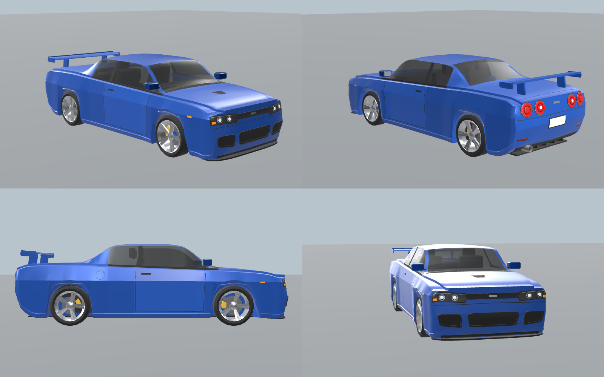
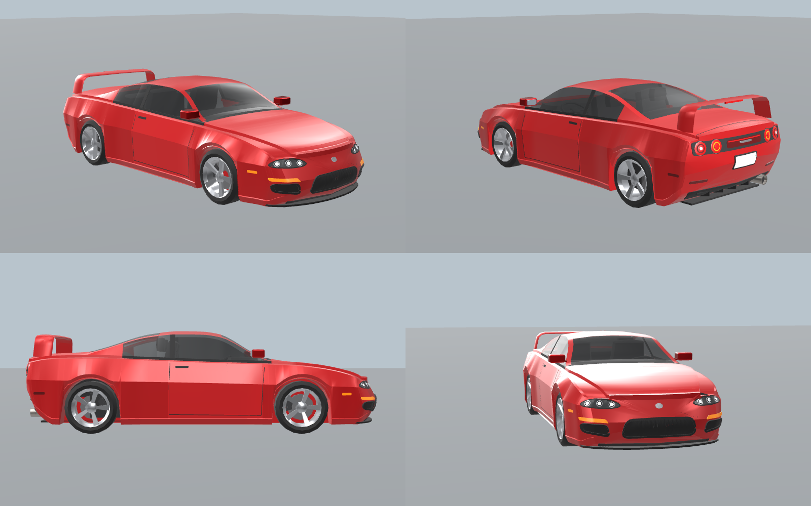
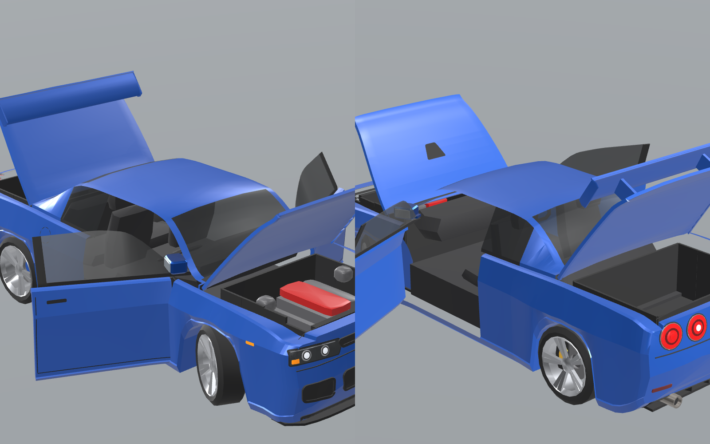
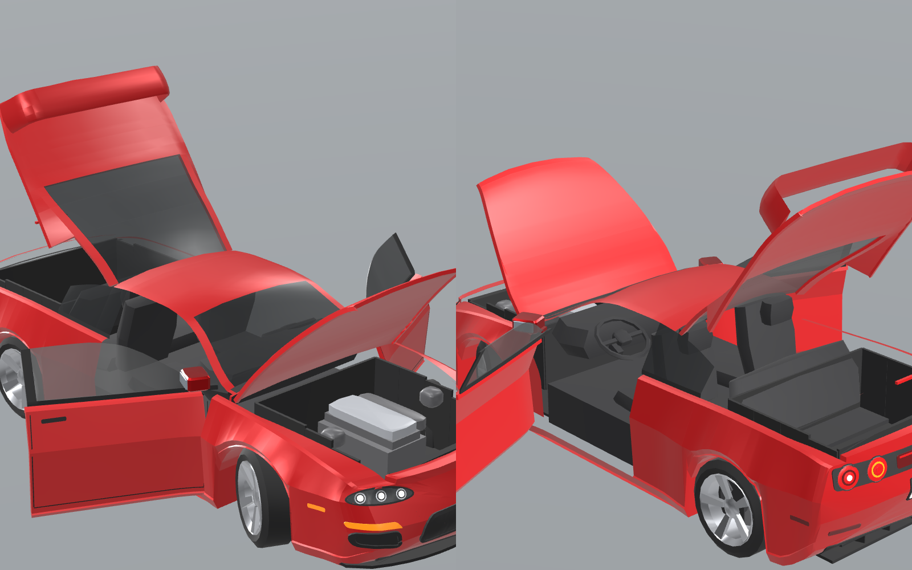
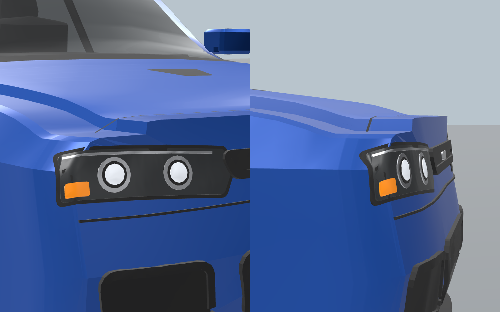
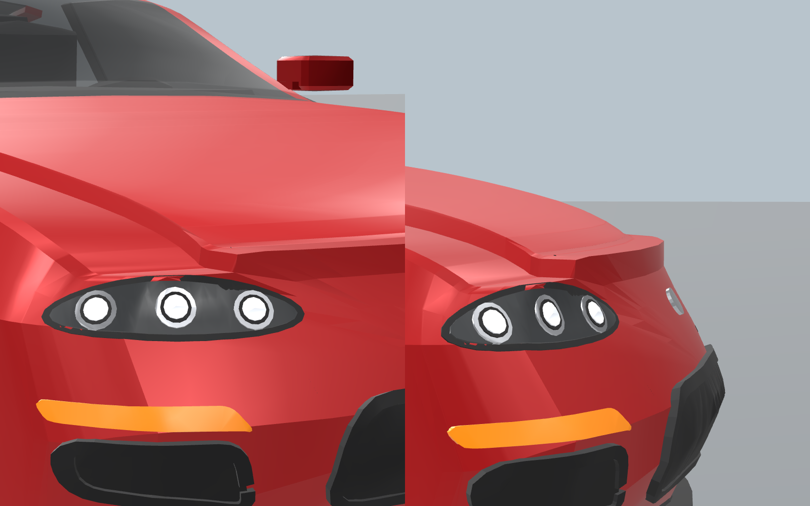

# Car assets

Semi-realistic, procedurally modelled cars for the map. Each car is an `.obj`
(+ `.mtl`) built to the real car's published dimensions, split into named parts
so Roblox Studio imports each part as its own MeshPart.

| Car | Folder | Preview |
| --- | --- | --- |
| Nissan Skyline GT-R (R34, 1999–2002) | `NissanSkylineGTR_R34/` |  |
| Toyota Supra Turbo (MK4 / JZA80, 1993–2002) | `ToyotaSupra_MK4/` |  |

## Importing into Roblox Studio

1. **File → Import 3D**, pick `NissanSkylineGTR_R34.obj` (or the Supra). Leave units on
   **Studs**, and import it as a Model with separate parts (not one merged mesh).
2. Put `roblox/CarSetup.server.lua` inside the imported Model as a **Script**.
   When the game runs it paints the car and builds the rig (see below).
   To see the paint while you build the map, select the Model and paste the same file
   into the **Command Bar**. That only applies the colours and materials.
3. For performance, set `CollisionFidelity` on `Body` to **Hull** in the Properties
   panel. Scripts can't change this property.

### What's modular

| Module | Parts | How it moves in Roblox |
| --- | --- | --- |
| Wheels ×4 | `Tire_XX`, `Rim_XX`, `Brake_XX` | Welded to an invisible cylinder that spins on a motor `HingeConstraint` |
| Front steering | `Caliper_FL/FR` + the front wheels | Servo hinge "knuckle". The calipers steer but don't spin |
| Doors ×2 | `Door_X`, `DoorGlass_X`, `DoorTrim_X`, `Mirror_X`, `MirrorGlass_X` | Hinged at the front edge. **F** to open/close |
| Hood | `Hood`, `HoodTrim` | Hinged at the windscreen. Engine and bay inside |
| Trunk / hatch | `Trunk`, `TrunkGlass`, `Wing` | Hinged at the rear window. On the Supra the whole glass hatch lifts with the wing |
| Seats | `Marker_DriverSeat`, `Marker_PassengerSeat` | Turned into a VehicleSeat and a Seat. **E** to Drive / Ride, WASD to drive |
| Lights | `HeadLights` (housing), `Lens` (projectors), `HeadlightGlass` (clear cover), `TailLights`, `TailLightsDark`, `TailLightsInner` | Projectors and the headlight beam switch on while driven. Brake lights glow when braking |

`Marker_*` parts are small invisible cubes that mark hinge and seat positions.
Keep them in the Model.

Model attributes (all optional):

| Attribute | Type | Default |
| --- | --- | --- |
| `BodyColor` | Color3 | factory colour (Bayside Blue / Renaissance Red) |
| `Drivable` | bool | `true`. Set `false` for a parked prop; doors still open |
| `MaxSpeed` | number | `140` studs/s (≈140 km/h at real-world scale) |
| `SteerAngle` | number | `32` degrees |
| `DriveType` | string | `AWD` for the R34 (ATTESA), `RWD` for the Supra |
| `LightsOn` | bool | `false`, which forces the lamps on when set |

Scale: 1 stud = 0.28 m (Roblox's real-world conversion), so the R34 is about 16.4
studs long. Most Roblox games use slightly oversized cars. To get those, scale the
Model before adding the script (e.g. `model:ScaleTo(1.3)`), or rebuild with
`--scale 0.22`. Forward is −Z, which is the Model's LookVector.

### Performance

Targets come from Roblox racing practice: desktop racers usually run 5k–15k
triangles per car; spend them on the silhouette, fenders and arches; keep the
underside and interior minimal; prefer fewer meshes
([devforum](https://devforum.roblox.com/t/meshpart-usage-performance-optimizations/1319217),
[devforum](https://devforum.roblox.com/t/140-150-mesh-parts-for-one-car-is-bad-for-performance/2961291),
[HWK Studio pack](https://hwk-studio.itch.io/230-low-poly-vehicle-body-rim-collection-roblox)).

| | Triangles | Parts | One wheel (tyre + rim + disc + caliper) |
| --- | --- | --- | --- |
| R34 | ~29.4k | 53 | ~750 |
| Supra | ~26.6k | 53 | ~690 |

Those totals include opening doors, hood and trunk (each a solid panel), an engine
bay and a basic interior. `build.py` refuses to export a car over the hard
**45,000-triangle** budget (`--budget` changes it).

How it stays light:

- **Panel-style body:** each cross-section is 17 points of mostly straight panels
  meeting at hard edges (sill, skirt step, character line, shoulder, belt, roof rail),
  like a real car body.
- **Crisp creases, smooth bends:** edges running along the car stay sharp, and bends
  toward the nose and tail are smooth-shaded.
- **Wheels:** 20 slices, box spokes, no lug nuts.
- **Lamp units:** headlights and round tail lamps are drawn on a flat 2D frame fitted
  to the body, so edges stay straight and lenses round and level. Each layer is then
  laid onto the paint a few millimetres deep, so the lamps sit embedded in the
  bodywork instead of sticking out.
- **Nose and tail:** the end faces are built from evenly spaced rings, and details are
  projected onto the exported triangles themselves, so no paint pokes through.
- **Lights and trim:** raised layers have no hidden undersides. Flat layers have no
  side walls. Lamp circles use 10–20 points.
- **Merged parts:** same-colour details share a part (`Chrome`, `Trim`, `Interior`,
  `Underbody`, `TailLightsDark`).
- **Shadows:** `CarSetup` lets only the big shapes cast shadows.

No part goes over Roblox's 20k-triangle limit; the exporter would split one automatically.
For a busy map, also set `RenderFidelity` to **Automatic** on the MeshParts in
Studio (scripts can't change it), so distant cars draw with fewer triangles.






## Reference data used

| | R34 GT-R | Supra MK4 Turbo |
| --- | --- | --- |
| Length × width × height | 4600 × 1786 × 1359 mm | 4520 × 1810 × 1275 mm |
| Wheelbase | 2665 mm | 2550 mm |
| Track F / R | 1481 / 1491 mm | 1520 / 1524 mm |
| Tyres | 245/40 ZR18 on 18×9 | 235/45 ZR17 F, 255/40 ZR17 R |
| Curb weight | ~1560 kg | ~1590 kg |

Design cues modelled:

Both cars sit lower than stock, with flush wheels, flared arches, a sharp character
line that wraps over each arch, side skirts, a front splitter and a rear diffuser.

- **R34:** boxy wedge, notchback roof, angular headlights with twin projectors, upper
  grille plus a three-opening bumper, NACA hood duct, four round tail lights, pillar
  wing, single exhaust, gold Brembo calipers, 5 twin-spoke wheels, RHD interior.
- **Supra:** long low nose, rounded body with wide rear hips, raked windscreen and
  glass hatch, oval tri-beam headlights, big centre mouth with amber indicators, hoop
  wing, full-width tail panel with twin round lamps per side, 5-spoke wheels, LHD
  interior.

Sources:
[autoevolution – Skyline GT-R R34 specs](https://www.autoevolution.com/cars/nissan-skyline-gt-r-r34-1999.html),
[ProjectJDM – R34 GT-R specs](https://projectjdm.org/wiki/specs/r34-gtr),
[gtr.co.uk – R34 kerb weight](https://www.gtr.co.uk/threads/r34-gt-r-v-spec-kerb-weight.122888/),
[ProjectJDM – Supra MK4 specs](https://projectjdm.org/blog/supra-mk4-specs),
[Car Memories – 1998 Supra MK4 specs](https://www.carmemories.com/articles/1998-toyota-supra-mk4-specs.html),
[tiresize.com – 1997 Supra Turbo tyres](https://tiresize.com/tires/Toyota/Supra/1997/Turbo/),
[cars.com – 1997 Supra specs](https://www.cars.com/research/toyota-supra-1997/specs/).

## Regenerating / tweaking

The meshes are generated by Python code in `generator/` (needs `numpy` only):

```
cd cars/generator
python3 build.py                 # rebuilds both cars
python3 build.py --only supra    # just one
python3 build.py --scale 0.22    # bigger, "Roblox-sized" cars
```

- `r34.py`, `supra.py`: each car's spec. Body cross-sections are keyframed along the
  car's length (`BODY`). `panels` sets where the doors, hood and trunk are cut from the
  shell, and `flare`, `bevel` and `crease_gap` set how aggressive the body lines are. `ends` shapes the nose and tail:
  `plan` sweeps the corners back, `top` leans the bumper top into the hood or trunk, and `bot` tucks the chin under. Lights, grilles, glass, panel gaps etc. are 2D outlines
  projected onto the body (`D`). Wing, mirrors, interior and exhaust are built
  separately.
- `carkit.py`: the toolkit: lofted body with wheel-arch cut-outs, projected decals,
  lathe/sweep primitives, wheels, and the OBJ exporter.
- `palette.py`: default colours (also mirrored in `roblox/CarSetup.server.lua`).

To add another car, copy `supra.py` and change the dimensions and keyframes first.
After that, adjust the decals.
